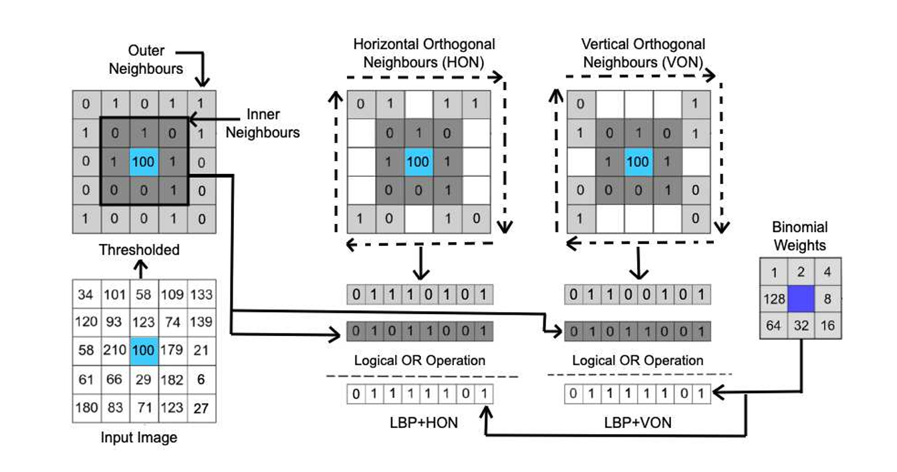
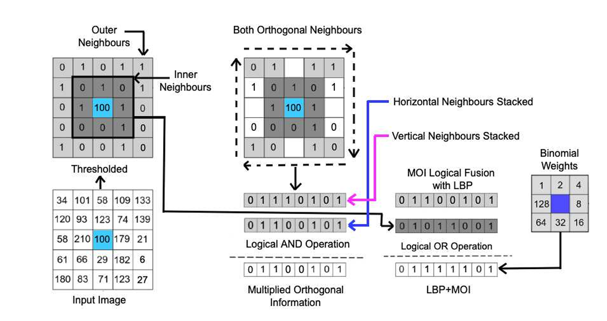
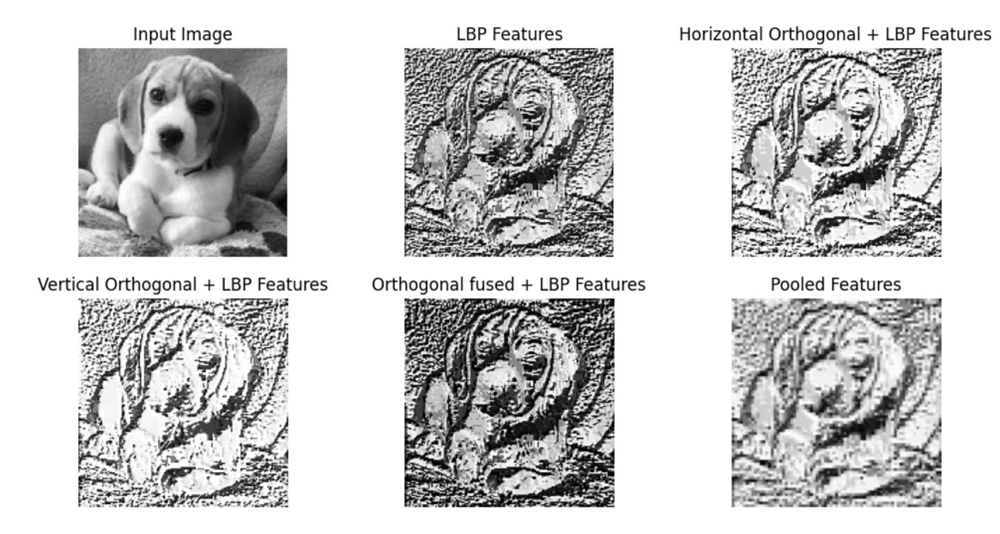
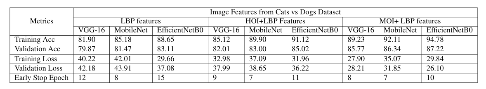
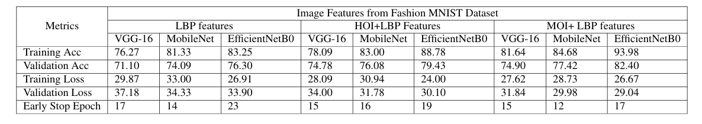
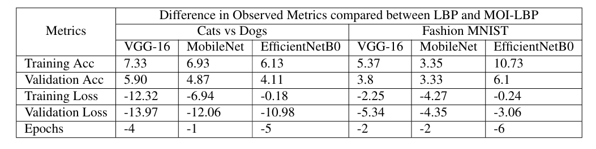

# Ortho-LBP: Enhanced Texture Features using Orthogonal Information Fusion

## Project Overview

Ortho-LBP is an image feature extraction framework designed to improve how textures are represented in classification tasks. Traditional Local Binary Patterns (LBPs) have been widely used for texture analysis, but they often miss fine-grained directional variations and spatial dependencies. This project introduces a novel family of LBP-based descriptors—HOI-LBP, VOI-LBP, and MOI-LBP—which embed orthogonal directional information into the LBP framework using bitwise logical fusion.

The idea behind Ortho-LBP is to go beyond the standard 3x3 LBP neighborhood and incorporate information from a 5x5 window centered around each pixel. By extracting horizontal and vertical orthogonal patterns and fusing them with conventional LBP encodings using bitwise operators like AND and OR, the method provides a more expressive, directionally aware feature descriptor. These enriched features are then used to train convolutional neural networks for image classification.

## Methodology

Each of the proposed methods introduces a distinct way of integrating orthogonal information.

### HOI-LBP and VOI-LBP

The Horizontal Orthogonal Information (HOI) and Vertical Orthogonal Information (VOI) variants extract directional bits from the outer columns and rows of the 5x5 pixel window, respectively. These are converted into binary codes and fused with the standard LBP of the center pixel. The fusion step—using bitwise AND—ensures that only meaningful, directionally reinforced texture information is retained.

  
*Figure: Illustration of HOI-LBP and VOI-LBP extraction process. The image shows how horizontal and vertical patterns from the 5x5 neighborhood are encoded and fused with standard LBP.*

### MOI-LBP

MOI-LBP takes the fusion a step further by combining both HOI and VOI outputs and multiplying them with the LBP value of the center pixel. This yields a composite texture descriptor that captures orthogonal interactions in multiple directions.

  
*Figure: Diagram of MOI-LBP logic. It shows how horizontal and vertical bit patterns are combined and fused with the central LBP to generate enhanced texture features.*

The features produced by these variants were extracted from two benchmark image datasets—Dogs vs Cats and Fashion MNIST—and used as inputs to CNN architectures including VGG-16, MobileNet, and EfficientNetB0. Each model was trained using LBP and the proposed variants to measure the impact on classification performance.

 

## Results and Discussion

Our experiments demonstrated that the proposed variants led to measurable improvements in classification performance across both datasets. MOI-LBP in particular showed the highest accuracy and lowest validation loss, outperforming traditional LBP in nearly every scenario.

On the Dogs vs Cats dataset, EfficientNetB0 combined with MOI-LBP achieved a validation accuracy of 87.22%, surpassing all other feature-model combinations. Similarly, in the Fashion MNIST experiment, the same model reached 82.46% validation accuracy using MOI-LBP—again outperforming both standard LBP and non-fused baselines.

These results are supported not only by accuracy metrics, but also by training behavior. Models trained on the fused features converged faster and exhibited fewer signs of overfitting, as seen in the loss curves and early stopping triggers.

    
*Figure: Classification performance comparison on the Dogs vs Cats dataset. The figure shows training and validation accuracy across various CNN models using different LBP-based features.*

   
*Figure: Classification results on Fashion MNIST using standard LBP and Ortho-LBP variants. MOI-LBP consistently leads in performance.*

   
*Figure: Summary of performance improvement metrics when using MOI-LBP over traditional LBP. This includes differences in training/validation accuracy and model loss.*

## Conclusion

Ortho-LBP demonstrates that logical fusion of orthogonal directional information with LBP can significantly enhance the quality of texture descriptors. This enriched representation leads to better classification accuracy, improved generalization, and faster convergence. The proposed features—HOI-LBP, VOI-LBP, and MOI-LBP—offer a simple yet powerful upgrade to traditional LBP for any vision task involving fine-grained texture.

Given their light computational footprint and compatibility with existing CNN pipelines, these methods can be readily integrated into real-world systems, particularly in domains like medical imaging, biometric verification, and material classification, where detail-rich texture understanding is vital.

## Citation

If you use this work or build on it, please cite:

```bibtex
@article{kumar2024ortholbp,
  title   = {Ortho-LBP: Novel Features for Enhanced Pattern Recognition through Bitwise Logical Fusion of Bidirectional Orthogonal Information with LBP},
  author  = {Nithish Kumar K and Nirmal G and Maitreya Vaghulade and Pranav Pateriya and Shairal Verma and Priyanka Rathee},
  year    = {2024},
  doi     = {10.21203/rs.3.rs-4550343/v1},
  url     = {https://doi.org/10.21203/rs.3.rs-4550343/v1}
}
```

## Contact

For any queries, collaboration opportunities, or further information about this project, feel free to reach out:

**Maitreya Vaghulade**  
📧 [maitreya.vaghulade@gmail.com](mailto:maitreya.vaghulade@gmail.com)  
